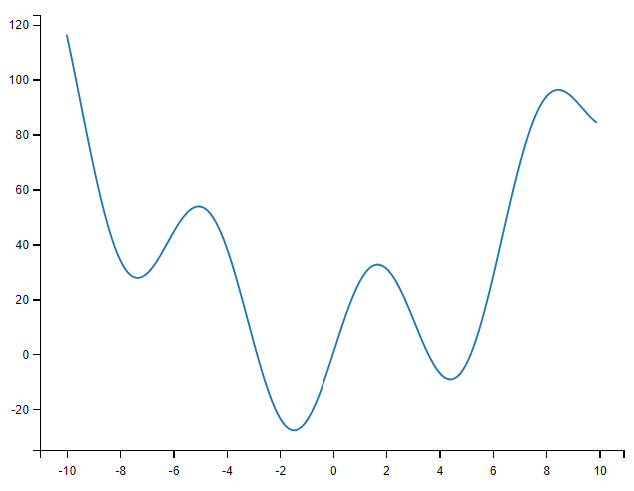
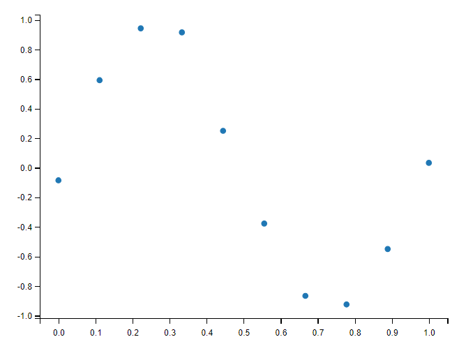
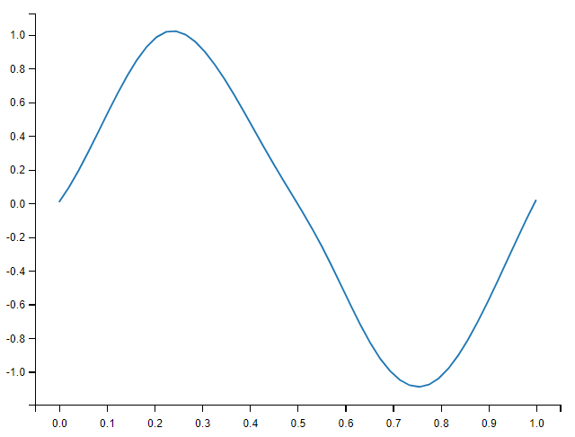
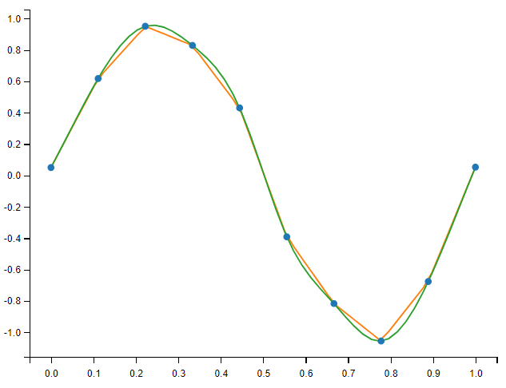
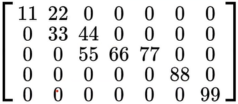

# 常用数据分析与可视化工具

## NumPy库介绍与应用

### numpy概述

1. Numerical Python，数值的Python，补充了Python语言所欠缺的数值计算能力。
2. Numpy是其它数据分析及机器学习库的底层库。
3. Numpy完全标准C语言实现，运行效率充分优化。
4. Numpy开源免费、快速、方便。

### 导入numpy

```python
import numpy as np
```

### 创建数组（array）

我们可以通过传递一个 `python` 列表，使用方法 `np.array()` 创建一个 NumPy 数组。


在很多场景下，我们希望 NumPy 能够帮我们初始化数组。

NumPy 提供了一些方法，比如 `ones(), zeros(), random.random()`。 我们只需要提供数组大小，如图：


```python
# 方式一
# 使用array函数从常规Python列表或元组中创建数组。得到的数组的类型是从Python列表中元素的类型推导出来的。
a = np.array([1,2,3,4])
print(a)  # [1 2 3 4]

b = np.array(range(10))
print(b)  # [0 1 2 3 4 5 6 7 8 9]

# 一个常见的错误，就是调用array的时候传入多个数字参数，而不是提供单个数字的列表类型作为参数。
# a = np.array(1,2,3,4)    # WRONG
a = np.array([1,2,3,4])  # RIGHT
print(a)  # [1 2 3 4]

# 方式二
#  NumPy提供了一个类似于range的函数，该函数返回数组array而不是列表list,
import numpy as np
c = np.arange(10)
print(c)  # [0 1 2 3 4 5 6 7 8 9]
list_c=list(range(10))
print(list_c)  # [0, 1, 2, 3, 4, 5, 6, 7, 8, 9]

# 方式三
#  zero方法或ones方法
import numpy as np
arry01=np.zeros((3))
print(arry01)
print('----------')
arry02=np.zeros((2,3))
print(arry02)
print('----------')
arry02=np.ones((2,3))
print(arry02)

# 输出
# [0. 0. 0.]
# ----------
# [[0. 0. 0.]
#  [0. 0. 0.]]
# ----------
# [[1. 1. 1.]
#  [1. 1. 1.]]
```

### 数组的形状

NumPy的数据结构为：`ndarray(N-Dimensional Array)`


```python
import numpy as np
# 一维数组
t1 = np.arange(12)
print(t1)  # [0 1 2 3 4 5 6 7 8 9 10 11]
print(t1.shape)  # (12,)
```

```python
import numpy as np
# 二维数组
t2 = np.array([[1,2,3],[4,5,6]])
print(t2)
# [[1 2 3]
#  [4 5 6]]
print(t2.shape)  # (2, 3)
```

```python
import numpy as np
# 三维数组
t3 = np.array([[[1,2,3],[4,5,6]],[[7,8,9],[10,11,12]]])
print(t3)
#  [[[ 1  2  3]
#   [ 4  5  6]]
#  [[ 7  8  9]
#   [10 11 12]]]
print(t3.shape)  # (2, 2, 3)
```

在大部分场合，处理一个新的维度只需要在 NumPy 的函数上参数上增加一个维度：

比如， `np.ones((4, 3, 2))` 将会打印如下：


```python
#举个例子
import numpy as np
arr_1= np.ones((4, 3, 2))
print(arr_1)

# [[[1. 1.]
#   [1. 1.]
#   [1. 1.]]
#  [[1. 1.]
#   [1. 1.]
#   [1. 1.]]

#  [[1. 1.]
#   [1. 1.]
#   [1. 1.]]

#  [[1. 1.]
#   [1. 1.]
#   [1. 1.]]]
```

### 数组维度操作

在高级的场合，可能需要变换矩阵的维度。机器学习中，常见。 比如当一个特定的模型需要一个一个特定维度的矩阵，而你的数据集的输入数据维度不一样的时候。

NumPy的reshape() 函数就变得有用了。 你只需指定你需要的新的矩阵的维度即可。你还可以通过将维度指定为 -1，NumPy 可以依据矩阵推断出正确的维度。


```python
import numpy as n
a = np.arange(1, 9)
print(a)        # [1 2 3 4 5 6 7 8]
b = a.reshape(2, 4) #变为2行4列的二维数组
print(b)  # [[1 2 3 4] [5 6 7 8]]
c = b.reshape(2, 2, 2) # 变为2页2行2列的三维数组
print(c)
# [[[1 2]
#   [3 4]] 
#  [[5 6]
#   [7 8]]]
```

```python
import numpy as np
c = np.array([[1,2,3,4], [5,6,7,8]])
print(c)
# [[1 2 3 4]
#  [5 6 7 8]]
e = c.flatten()
print(e)  # [1 2 3 4 5 6 7 8]
```

```python
import numpy as np
a = np.array([[1,2,3,4], [5,6,7,8]])
print(a)
# [[1 2 3 4]
#  [5 6 7 8]]
a.resize(2, 2, 2)
print(a)
# [[[1 2]
#  [3 4]]

# [[5 6]
#  [7 8]]]
```

```python
import numpy as np
# 三维数组中的形状(2,3,4)表示2个块数据，3行数据，4列数据
t5 = np.arange(24)
print(t5)
print('-------------------------')
t5 = t5.reshape((2,3,4))
print(t5)   
```

输出：

```txt
[0 1 2 3 4 5 6 7 8 9 10 11 12 13 14 15 16 17 18 19 20 21 22 23]
-------------------------
[[[ 0  1  2  3]
  [ 4  5  6  7]
  [ 8  9 10 11]]

 [[12 13 14 15]
  [16 17 18 19]
  [20 21 22 23]]]
```

```python
t5 = t5.reshape((4,6))
print(t5)
```

输出

```
[[ 0  1  2  3  4  5]
 [ 6  7  8  9 10 11]
 [12 13 14 15 16 17]
 [18 19 20 21 22 23]]
```

### 数组的计算

我们首先创建两个 NumPy 数组，一个是 data 数组，一个是 ones数组。


他们按照位置顺序（比如每行的值）相加，data + ones。


不只有加法，我们还可以以如下方式去计算：


计算一个数组和一个数字的操作（也称作对向量和标量的操作）。


可以看到 NumPy 的乘法机制是对每一个单元都进行计算，称作 广播（broadcast）机制。

### 索引/切片

我们可以对 NumPy 数组进行索引或者切片，就像对 python 列表一样的操作：

> * Numpy数组是同质数组，即所有元素的数据类型必须相同。
> * Numpy数组的下标从0开始，最后一个元素的下标为数组长度减1，同python的列表。


### 对于多维数组

数组对象 `[…, 页号, 行号, 列号]`

下标从0开始，到数组len-1结束。

```python
import numpy as np
a = np.array([[[1, 2],
               [3, 4]],
              [[5, 6],
               [7, 8]]])
print(a)
print('-------------------')
# print(a[0])
# print('-------------------')
# print(a[0][0])
# print('-------------------')
print(a[0][0][0])
```

输出：

```txt
[[[1 2]
  [3 4]]

 [[5 6]
  [7 8]]]
-------------------
1
```

```python
import numpy as np
a = np.arange(1, 10)
print(a) 
print('----------------------')
# print(a[0:3])  
# print(a[3:6])  
# print(a[6:])  
# print(a[::-1])  
print(a[-4:-1])  
```

输出：

```
[1 2 3 4 5 6 7 8 9]
----------------------
[6 7 8]
```

```python
import numpy as np
a = np.arange(1, 10)
print(a) 
print('----------------------')
# print(a[::])  
# print(a[:])  
# print(a[::3])  
print(a[1::3])  
```

输出：

```
[1 2 3 4 5 6 7 8 9]
----------------------
[2 5 8]
```

```python
import numpy as np
a = np.arange(1, 10)
a = a.reshape(3,3)
print(a)  
print('----------------------')
# print(a[0:3])  
# print(a[::])  
# print('----------------------')
print(a[::-1])  
```

输出：

```
[[1 2 3]
 [4 5 6]
 [7 8 9]]
----------------------
[[7 8 9]
 [4 5 6]
 [1 2 3]]
```

```python
import numpy as np
a = np.arange(1, 28)
a.resize(3,3,3)
print(a)
print('----------------------')
# 切出索引为1的模块 
print(a[1, :, :])
print('----------------------')
```

输出：

```txt
[[[ 1  2  3]
  [ 4  5  6]
  [ 7  8  9]]

 [[10 11 12]
  [13 14 15]
  [16 17 18]]

 [[19 20 21]
  [22 23 24]
  [25 26 27]]]
----------------------
[[10 11 12]
 [13 14 15]
 [16 17 18]]
----------------------
```

```python
import numpy as np
a = np.arange(1, 28)
a.resize(3,3,3)
print(a)
print('----------------------')
# #切出所有模块的索引为1行
# print(a[:, 1, :])
# print('----------------------')
#切出0模块的1行1列
print(a[0, :, 1])
```

输出：

```
[[[ 1  2  3]
  [ 4  5  6]
  [ 7  8  9]]

 [[10 11 12]
  [13 14 15]
  [16 17 18]]

 [[19 20 21]
  [22 23 24]
  [25 26 27]]]
----------------------
[2 5 8]
```

### numpy读取本地数据

np.loadtxt(fname, dtype=float, comments='#', delimiter=None,converters=None, skiprows=0, usecols=None, unpack=False,ndmin=0, encoding='bytes', max\_rows=None)

> - `loadtxt`：从文本文件中读取内容
> - `fname`：文件的位置
> - `dtype`：数据读取后指定数据的类型
> - `delimiter`：数据的分隔符，例如在csv中是逗号
> - `skiprows`：跳过哪一行，例如csv中第一行是标题，我们也可以跳过第一行
> - `usecols`：我们要使用哪些列，索引，元组类型
> - `unpack`：表示转置

```python
import numpy as np
us_file_path = "USvideos.csv"
t1 = np.loadtxt(us_file_path,delimiter=",")
# 当数据比较大的时候会用科学计数法
print(t1)
```

输出：

```
[[2.400000e+01 4.394029e+06 3.200530e+05 5.931000e+03 4.624500e+04]
 [2.800000e+01 7.860119e+06 1.858530e+05 2.667900e+04 0.000000e+00]
 [2.200000e+01 5.845909e+06 5.765970e+05 3.977400e+04 1.707080e+05]
 ...
 [1.000000e+01 1.429080e+05 7.088000e+03 6.800000e+01 4.370000e+02]
 [2.400000e+01 2.453200e+04 2.148000e+03 7.700000e+01 0.000000e+00]
 [2.800000e+01 1.440390e+05 1.574000e+03 5.900000e+01 0.000000e+00]]
```

```python
import numpy as np
us_file_path = "USvideos.csv"
t1 = np.loadtxt(us_file_path,delimiter=",",dtype='int')
print(t1)
```

输出：

```
[[     24 4394029  320053    5931   46245]
 [     28 7860119  185853   26679       0]
 [     22 5845909  576597   39774  170708]
 ...
 [     10  142908    7088      68     437]
 [     24   24532    2148      77       0]
 [     28  144039    1574      59       0]]
```

### numpy数组中数值的修改

```python
# 重新赋值
t1[:,0:2]=0
print(t1)
```

输出：

```
[[     0      0 320053   5931  46245]
 [     0      0 185853  26679      0]
 [     0      0 576597  39774 170708]
 ...
 [     0      0   7088     68    437]
 [     0      0   2148     77      0]
 [     0      0   1574     59      0]]
```

### 数组的拼接/拆分

```python
# 简单的一维数组组合方案
import numpy as np
a = np.arange(1,9)
b = np.arange(9,17)
print(a)
print('------------------------')
print(b)
```

输出：

```
[1 2 3 4 5 6 7 8]
------------------------
[ 9 10 11 12 13 14 15 16]
```

```python
# 把两个数组摞在一起成两行
c = np.row_stack((a, b))
print(c)
```

输出：

```
[[ 1  2  3  4  5  6  7  8]
 [ 9 10 11 12 13 14 15 16]]
```

```python
# 把两个数组组合在一起成两列
d = np.column_stack((a, b))
print(d)
```

输出：

```
[[ 1  9]
 [ 2 10]
 [ 3 11]
 [ 4 12]
 [ 5 13]
 [ 6 14]
 [ 7 15]
 [ 8 16]]
```

```python
# 垂直方向操作
import numpy as np
a = np.arange(1, 7).reshape(2, 3)
b = np.arange(7, 13).reshape(2, 3)
print(a)
print('--------------------------')
print(b)
```

输出：

```
[[1 2 3]
 [4 5 6]]
--------------------------
[[ 7  8  9]
 [10 11 12]]
```

```python
# 垂直方向完成组合操作，生成新数组
c = np.vstack((a, b)) # vertical 垂直的
print(c)
```

输出：

```
[[ 1  2  3]
 [ 4  5  6]
 [ 7  8  9]
 [10 11 12]]
```

```python
# 垂直方向完成拆分操作，生成两个数组
d, e = np.vsplit(c, 2)
print(d)
print('---------------------')
print(e)
```

输出：

```
[[1 2 3]
 [4 5 6]]
---------------------
[[ 7  8  9]
 [10 11 12]]
```

```python
x, y, z, w = np.vsplit(c, 4)
print(x)
print('---------------------')
print(y)
print('---------------------')
print(z)
print('---------------------')
print(w)
```

输出

```
[[1 2 3]]
---------------------
[[4 5 6]]
---------------------
[[7 8 9]]
---------------------
[[10 11 12]]
```

```python
# 水平方向操作
import numpy as np
a = np.arange(1, 7).reshape(2, 3)
b = np.arange(7, 13).reshape(2, 3)
print(a)
print('---------------------------')
print(b)
```

输出：

```
[[1 2 3]
 [4 5 6]]
---------------------------
[[ 7  8  9]
 [10 11 12]]
```

```python
# 水平方向完成组合操作，生成新数组 
c = np.hstack((a, b)) # horizontal,水平的
print(c)
```

输出：

```
[[ 1  2  3  7  8  9]
 [ 4  5  6 10 11 12]]
```

```python
# 水平方向完成拆分操作，生成两个数组
d, e = np.hsplit(c, 2)
print(d)
print('-----------------------------')
print(e)
```

输出：

```
[[1 2 3]
 [4 5 6]]
-----------------------------
[[ 7  8  9]
 [10 11 12]]
```

```python
x,y,z = np.hsplit(c, 3)
print(x)
print('-----------------------------')
print(y)
print('-----------------------------')
print(z)
```

输出：

```
[[1 2]
 [4 5]]
-----------------------------
[[ 3  7]
 [ 6 10]]
-----------------------------
[[ 8  9]
 [11 12]]
```

```python
# 多维数组组合与拆分的相关函数
a = np.arange(1, 7).reshape(2, 3)
b = np.arange(7, 13).reshape(2, 3)
print(a)
print('-----------------------')
print(b)
```

输出：

```
[[1 2 3]
 [4 5 6]]
-----------------------
[[ 7  8  9]
 [10 11 12]]
```

```python
# 通过axis作为关键字参数指定组合的方向，取值如下：
# 若待组合的数组都是二维数组：
#   0: 垂直方向组合
#   1: 水平方向组合
# 若待组合的数组都是三维数组：
#   0: 垂直方向组合
#   1: 水平方向组合
#   2: 深度方向组合
c = np.concatenate((a, b), axis=1)
print(c)
```

输出：

```txt
[[ 1  2  3  7  8  9]
 [ 4  5  6 10 11 12]]
```

```python
# 通过axis作为关键字参数指定组合的方向，取值如下：
# 若待组合的数组都是二维数组：
#   0: 垂直方向组合
#   1: 水平方向组合

# 若待组合的数组都是三维数组：
#   0: 垂直方向组合
#   1: 水平方向组合
#   2: 深度方向组合
# 通过给出的数组与要拆分的份数，按照某个方向进行拆分，axis的取值同上
d,e = np.split(c, 2, axis=0)
print(d)
print(e)
```

输出：

```txt
[[1 2 3 7 8 9]]
[[ 4  5  6 10 11 12]]
```

### numpy生成随机数

> `numpy.random.`


| 函数名称                                             | 函数功能                                                | 参数说明                                                                                                                    |
| ---------------------------------------------------- | ------------------------------------------------------- | --------------------------------------------------------------------------------------------------------------------------- |
| `rand(d0, d1, …, dn)`                               | 产生均匀分布的随机数                                    | dn为第n维数据的维度                                                                                                         |
| `randn(d0, d1, …, dn)`                              | 产生标准正态分布随机数                                  | dn为第n维数据的维度                                                                                                         |
| `randint(low[, high, size, dtype])`                  | 产生随机整数                                            | low：最小值；high：最大值；size：数据个数                                                                                   |
| `np.random.seed(n)`                                  | 函数用于生成指定随机数                                  | 参数比喻成“堆”；eg. seed(5)：表示第5堆种子                                                                                |
| `numpy.random.uniform(low,high,size)`                | 从一个均匀分布[low,high)中随机采样，包含low，不包含high | low: 采样下界，float类型，默认值为0；high: 采样上界，float类型，默认值为1；size: 输出样本数目，为int或元组(tuple)类型       |
| `numpy.random.normal(loc=0.0, scale=1.0, size=None)` | 从正态（高斯）分布中抽取随机样本                        | loc，浮点型数据或者浮点型数据组成的数组，分布的均值（中心）；scale，浮点型数据或者浮点型数据组成的数组 分布的标准差（宽度） |

```python
import numpy as np
# 产生均匀分布的随机数
np.random.rand(2,3) 
# array([[0.28352508, 0.69313792, 0.44045372],
#        [0.15686774, 0.54464902, 0.78031476]])
```

```python
# 产生标准正态分布随机数
import numpy as np
np.random.randn(2,3)
# array([[ 0.74505627,  1.97611078, -1.24412333],
#        [-0.62641691, -0.80376609, -2.41908317]])
```

```python
import numpy as np
a = np.random.seed(3)
b = np.random.randn(2,3)
print(b)
# [[1.78862847  0.43650985  0.09649747]
#  [-1.8634927  -0.2773882  -0.35475898]]
```

### numpy中常用统计函数

> * 求和：`t.sum(axis=None)`
> * 均值：`t.mean(a,axis=None)`，受离群点的影响较大
> * 中值：`np.median(t,axis=None)`
> * 最大值：`t.max(axis=None)`
> * 最小值：`t.min(axis=None)`
> * 极值：`np.ptp(t,axis=None)`，即最大值和最小值的差
> * 标准差：`t.std(axis=None)`，衡量一组数据平均值分散程度，反映出数据的波动稳定情况，标准差较大，代表大部分数值和其平均值之间差异较大，波动越大，越不稳定；标准差较小，代表这些数值较接近平均值。

NumPy 提供的另外一个优点是聚合功能。


除了 min, max 和 sum, 还有 mean 可以获取平均值，prod 可以获取所有元素相乘的结果， std 可以获取标准差，等等其他功能。

#### 矩阵聚合

与向量（数组）相同，可以对矩阵进行类似的聚合操作：


而且不仅可以对矩阵中的所有值进行聚合，还能对行或列进行单独的聚合操作，使用 axis 参数进行指定（axis是轴的意思）：


#### 矩阵运算

如果两个矩阵的行列数相同，我们可以使用运算符（+ - \* /）对矩阵进行运算。NumPy 也是基于位置来进行操作：


这些运算符也可以在不同的行列数的矩阵上使用。只要不同维度的矩阵，有一个是一维矩阵（例如，只有一行或一列），在这种形式上， NumPy 使用了 broadcast 规则来进行计算：


#### 矩阵索引

当我们使用矩阵的时候索引和切片功能将更加有用：


## SciPy库介绍与应用

SciPy包含许多专注于科学计算中的常见问题的工具箱。它的子模块对应于不同的应用，比如插值、积分、优化、图像处理、统计和特殊功能等。

### SciPy 安装

```sh
pip install -U scipy
```

### SciPy任务子模块


| 关键词参数          | 可选值             |
| ------------------- | ------------------ |
| `scipy.cluster`     | 向量计算           |
| `scipy.constants`   | 物理和数学常量     |
| `scipy.fftpack`     | 傅里叶变换         |
| `scipy.interpolate` | 插值               |
| `scipy.io`          | 数据输入和输出     |
| `scipy.linalg`      | 线性代数程序       |
| `scipy.ndimagen`    | 维图像包           |
| `scipy.odr`         | 正交距离回归       |
| `scipy.optimize`    | 优化               |
| `scipy.signal`      | 信号处理           |
| `scipy.sparse`      | 稀疏矩阵           |
| `scipy.spatial`     | 空间数据结构和算法 |
| `scipy.special`     | 一些特殊数学函数   |
| `scipy.stats`       | 统计               |

### 文件输入/输出

载入和保存matlab文件：

```python
import numpy as np
from scipy import stats 
from scipy import io as spio

# 创建一个3*3的矩阵，其中元素的值都为 1
a = np.ones((3, 3))
# 保存到文件中
spio.savemat('file.mat', {'a': a}) # savemat expects a dictionary

# 载入
data = spio.loadmat('file.mat', struct_as_record=True)#加载 MATLAB 文件
a_temp = data['a']
print(a_temp)
```

输出：

```txt
[[1. 1. 1.]
 [1. 1. 1.]
 [1. 1. 1.]]
```

`scipy.io.loadmat(file_name, mdict=None, appendmat=True, **kwargs)` 用法：
参数：

- `file_name`： `str`
- `mat` 文件的名称(如果 `appendmat==True`，则不需要 `.mat` 扩展名)。也可以通过打开的 `file-like` 对象。
- `mdict`： 字典，可选
- 在其中插入 `matfile` 变量的字典。
- `appendmat`： 布尔型，可选
- 如果不存在，则将 `.mat` 扩展名附加到给定文件名的末尾。默认为真。
- `byte_order`： `str` 或无，可选
- 默认情况下无，暗示从 `mat` 文件中猜测的字节顺序。否则可以是`(‘native’、'='、‘little’、'<'、'BIG'、'>')`之一。
- `mat_dtype`： 布尔型，可选，如果为 `True`，则返回与加载到 `MATLAB` 相同 `dtype` 的数组(而不是保存它们的 `dtype`)。
- `squeeze_me`： 布尔型，可选，是否压缩单位矩阵维度。
- `chars_as_strings`： 布尔型，可选，是否将 `char` 数组转换为字符串数组。
- `matlab_compatible`： 布尔型，可选，返回将由`MATLAB` 加载的矩阵(暗示 `squeeze_me=False、chars_as_strings=False、mat_dtype=True、struct_as_record=True`)。
- `struct_as_record`： 布尔型，可选，是否将 `MATLAB` 结构加载为 `NumPy` 记录数组，或者加载为 `dtype=object` 的 `old-style NumPy` 数组。将此标志设置为 `False` 会复制 `scipy` 版本 `0.7.x` 的行为（返回 `NumPy` 对象数组）。默认设置为 `True`，因为它允许更轻松地 round-trip 加载和保存 `MATLAB` 文件。
- `verify_compressed_data_integrity`： 布尔型，可选，是否应检查 `MATLAB` 文件中压缩序列的长度，以确保它们不会比我们预期的长。建议启用此函数(默认设置)，因为 `MATLAB` 文件中过长的压缩序列通常表明文件已发生某种损坏。
- `variable_names`： 无或序列，如果 `None` (默认值) - 读取文件中的所有变量。否则，`variable_names` 应该是一个字符串序列，给出要从文件中读取的 `MATLAB` 变量的名称。阅读器将跳过名称不在此序列中的任何变量，可能会节省一些读取处理。
- `simplify_cells`： 错误的，可选的，如果为 `True`，则返回简化的 `dict` 结构(如果 `mat` 文件包含元胞数组，这很有用)。请注意，这只影响结果的结构，而不影响其内容(这对于两个输出结构都是相同的)。如果为 `True`，这会自动将 `struct_as_record` 设置为 `False`，并将 `squeeze_me` 设置为 `True`，这是简化单元格所必需的。

### 线性代数操作

`scipy.linalg` 模块提供了标准的线性代数操作。

#### 计算方阵的行列式

> `scipy.linalg.det()`

```python
# 线性代数操作
from scipy import linalg
arr = np.array([[1, 2],
                [3, 4]])
linalg.det(arr)  # 求取行列式的值 det 
# -2.0
```

:::warning 注意:warning:

`linalg.det()` 函数只能计算方阵行列式。

下面这段代码会报错：

```python
linalg.det(np.ones((3, 4)))
```

:::

#### 计算逆方阵

> `scipy.linalg.inv()`

```python
arr = np.array([[1, 2],
                 [3, 4]])
iarr = linalg.inv(arr)
iarr
```

输出：

```txt
array([[-2. ,  1. ],
       [ 1.5, -0.5]])
```

逆奇异矩阵不可做逆运算：

```python
# 最后计算逆奇异矩阵（行列式为0）将抛出 LinAlgError :
arr = np.array([[3, 2],
                [6, 4]])

try:
    linalg.inv(arr)
except np.linalg.LinAlgError as err:
    print(err)  # singular matrix
```

#### 判断矩阵与矩阵的逆乘积

> 是否为单位矩阵

```python
# 判断矩阵与矩阵的逆乘积是否为单位矩阵
np.allclose(np.dot(arr, iarr), np.eye(2))  # True
```

### 信号处理

> scipy.signal

`scipy.signal.detrend()`：从信号中删除线性趋势：

```python
# scipy.signal.detrend(): 从信号中删除线性趋势：
from scipy import signal
import numpy as np
import matplotlib.pyplot as plt

# 产生100个点
size = 100
# x个点放置到 x轴
x = np.linspace(0, 10, size)
# 构造一个线性函数
y_linear = 0.5*x + 1
# 绘制出该线性函数
plt.plot(x, y_linear, linewidth=1, color="blue")


# 随机产生 size 个点作为噪声
random_list = np.random.normal(size=size)
# 给线性函数加上噪声，使其具有随机性
y_random = y_linear + random_list
# 绘制出该函数
plt.plot(x, y_random, linewidth=1, color="orange")

# 从信号中删除线性趋势
y_detrend = signal.detrend(y_random)
# 绘制出该去除线性后的情况
plt.plot(x, y_detrend, linewidth=1, color="red")
plt.show()
```

### 优化

优化是寻找最小化或等式的数值解的问题。

`scipy.optimize` 模块提供了函数最小化（标量或多维度）、曲线拟合和求根等常用算法。

```python
from scipy import optimize
import numpy as np
import matplotlib.pyplot as plt
```

#### 寻找标量函数的最小值

```python
# 定义函数
def f(x):
    return x**2 + 30*np.sin(x)

# 设置自变量 x
x = np.arange(-10, 10, 0.1)
# 设置因变量 y
y = f(x)

# 绘制图像
plt.plot(x, y) 
plt.show() 
```

输出：



找到这个函数的最小值的常用有效方式是从给定的初始点开始进行一个**梯度下降**。

**BFGS算法**（较好方式）：

```python
from scipy import optimize

optimize.fmin_bfgs(f, 0) #其中，f是函数，0是初始位置
```

输出：

```txt
Optimization terminated successfully.
         Current function value: -27.686928
         Iterations: 4
         Function evaluations: 12
         Gradient evaluations: 6
```

这个方法的一个可能问题是，如果这个函数有一些局部最低点，算法可能找到这些局部最低点而不是全局最低点，这取决于初始点，如：

```python
optimize.fmin_bfgs(f, 3)
```

输出：

```txt
Optimization terminated successfully.
         Current function value: -9.190945
         Iterations: 5
         Function evaluations: 14
         Gradient evaluations: 7
```

显然，`-9.190945` 是局部最低点，不是全局最低点。

如果我们不知道全局最低点，并且使用其临近点来作为初始点，那么我们需要付出昂贵的代价来获得全局最优。要找到全局最优点，最简单的算法是暴力算法，算法中会评估给定网格内的每一个点：

```python
grid = (-10, 10, 0.1)
# 用暴力方法找到给定范围内的每一个点
xmin_global = optimize.brute(f, (grid,))
print(xmin_global)  # [-1.47246094]
```

对于更大的网格，`scipy.optimize.brute()` 变得非常慢。 `scipy.optimize.anneal()` 提供了一个替代的算法，使用模拟退火算法。

#### 找出局部最低点

我们用 `scipy.optimize.fminbound` 将变量限制在 `(0,10)` 区间：

```python
xmin_local = optimize.fminbound(f, 0, 10)  
print(xmin_local)  # 3.8374671194983834
```

### 插值

在数学的数值分析领域中，插值（`interpolation`）是一种通过已知的、离散的数据点，在范围内推求新数据点的过程或方法。简单来说插值是一种在给定的点之间生成点的方法。

在机器学习中我们经常处理数据缺失的数据，插值通常可用于替换这些值。这种填充值的方法称为插补。除了插补，插值经常用于我们需要平滑数据集中离散点的地方。

`scipy.interpolate` 从实验数据中拟合出函数，进而插入新的点。

#### 一维插值

> 在一维插值中，点是针对单个曲线拟合的

一维数据的插值运算可以通过方法 `interp1d()` 完成。该方法接收两个参数 `x` 点和 `y` 点。返回值是可调用函数，该函数可以用新的 `x` 调用并返回相应的 `y`，其中 `y = f(x)`。

假想一个接近 `sine` 函数的实验数据：

```python
measured_time = np.linspace(0, 1, 10)
noise = (np.random.random(10)*2 - 1) * 1e-1
measures = np.sin(2 * np.pi * measured_time) + noise
# 绘制图像
# plt.figure(figsize=(6, 4))
plt.plot(measured_time, measures, 'o', ms=6, label='measures')
plt.show()
```



`scipy.interpolate.interp1d` 类可以建立一个线性插值函数：

```python
linear_interp = interp1d(measured_time, measures, kind="linear")  # 默认是 linear
print(type(linear_interp))  # <class 'scipy.interpolate._interpolate.interp1d'>
computed_time = np.linspace(0, 1, 50)
linear_results = linear_interp(computed_time)   # 默认是 linear
plt.plot(computed_time, linear_results, label='linear interp')
plt.show()
```


通过提供可选的参数 `kind` 也可以选择进行立方插值：

```python
cubic_interp = interp1d(measured_time, measures, kind='cubic')
cubic_results = cubic_interp(computed_time)

plt.plot(computed_time, cubic_results, label='cubic interp')
plt.show()
```



现在结果可以被整合为下面的 `Matplotlib` 图片:

```python
plt.plot(measured_time, measures, 'o', ms=6, label='measures')
plt.plot(computed_time, linear_results, label='linear interp')
plt.plot(computed_time, cubic_results, label='cubic interp')
plt.show()
```



#### 单变量插值

> 在样条插值中，点是针对使用多项式分段定义的函数拟合的。

单变量插值使用 `UnivariateSpline()` 函数，该函数接受 `xs` 和 `ys` 并生成一个可调用函数，该函数可以用新的 `xs` 调用。

分段函数：就是对于自变量 `x` 的不同的取值范围，有着不同的解析式的函数。

为非线性点找到 `2.1、2.2...2.9` 的单变量样条插值：

```python
from scipy.interpolate import UnivariateSpline
import numpy as np

xs = np.arange(10)
ys = xs**2 + np.sin(xs) + 1

interp_func = UnivariateSpline(xs, ys)

newarr = interp_func(np.arange(2.1, 3, 0.1))

print(newarr)   # [5.62826474 6.03987348 6.47131994 6.92265019 7.3939103 7.88514634 8.39640439 8.92773053 9.47917082]
```

#### 径向基函数插值

径向基函数是对应于固定参考点定义的函数。

曲面插值里我们一般使用径向基函数插值。

`Rbf()` 函数接受 `xs` 和 `ys` 作为参数，并生成一个可调用函数，该函数可以用新的 `xs` 调用。

```python
from scipy.interpolate import Rbf
import numpy as np

xs = np.arange(10)
ys = xs**2 + np.sin(xs) + 1

interp_func = Rbf(xs, ys)

newarr = interp_func(np.arange(2.1, 3, 0.1))

print(newarr)  # [6.25748981 6.62190817 7.00310702 7.40121814 7.8161443  8.24773402 8.69590519 9.16070828 9.64233874]
```

### 稀疏矩阵

稀疏矩阵（`sparse matrix`）指的是在数值分析中绝大多数数值为零的矩阵。反之，如果大部分元素都非零，则这个矩阵是稠密的(`Dense`)。


上图中左边就是一个稀疏矩阵，可以看到包含了很多 0 元素，右边是稠密的矩阵，大部分元素不是 0。



上述稀疏矩阵仅包含 9 个非零元素，另外包含 26 个零元。其稀疏度为 74%，密度为 26%。

SciPy 的 `scipy.sparse` 模块提供了处理稀疏矩阵的函数。

主要使用以下两种类型的稀疏矩阵：

- `CSC` - 压缩稀疏列（`Compressed Sparse Column`），按列压缩。
- `CSR` - 压缩稀疏行（`Compressed Sparse Row`），按行压缩。

#### CSR 矩阵

通过向 `scipy.sparse.csr_matrix()` 函数传递数组来创建一个 `CSR` 矩阵。

```python
import numpy as np
from scipy.sparse import csr_matrix

arr = np.array([0, 0, 0, 0, 0, 1, 1, 0, 2])

print(csr_matrix(arr))
# (0, 5)	1
# (0, 6)	1
# (0, 8)	2
```

结果解析：

- 第一行：在矩阵第一行（索引值 0 ）第六（索引值 5 ）个位置有一个数值 1。
- 第二行：在矩阵第一行（索引值 0 ）第七（索引值 6 ）个位置有一个数值 1。
- 第三行：在矩阵第一行（索引值 0 ）第九（索引值 8 ）个位置有一个数值 2。

#### CSR 矩阵方法

使用 `data` 属性查看存储的数据（不含 0 元素）：

```python
import numpy as np
from scipy.sparse import csr_matrix

arr = np.array([
                [0, 0, 0], 
                [0, 0, 1], 
                [3, 0, 2]
               ])

print(csr_matrix(arr).data)  # [1 3 2]
```

使用 `count_nonzero()` 方法计算非 0 元素的总数：

```python
import numpy as np
from scipy.sparse import csr_matrix

arr = np.array([
                [0, 0, 0], 
                [0, 0, 1], 
                [3, 0, 2]
               ])

print(csr_matrix(arr).count_nonzero())  # 3
```

使用 `eliminate_zeros()` 方法删除矩阵中 0 元素：

```python
import numpy as np
from scipy.sparse import csr_matrix

arr = np.array([
                [0, 0, 0], 
                [0, 0, 1], 
                [3, 0, 2]
               ])

mat = csr_matrix(arr)
mat.eliminate_zeros()

print(mat)
# (1, 2)	1
# (2, 0)	3
# (2, 2)	2
```

使用 `sum_duplicates()` 方法来删除重复项:

```python
import numpy as np
from scipy.sparse import csr_matrix

arr = np.array([
                [0, 0, 0], 
                [0, 0, 1], 
                [3, 0, 2]
               ])

mat = csr_matrix(arr)
mat.sum_duplicates()

print(mat)
# (1, 2)	1
# (2, 0)	3
# (2, 2)	2
```

`csr` 转换为 `csc` 使用 `tocsc()` 方法：

```python
import numpy as np
from scipy.sparse import csr_matrix

arr = np.array([
                [0, 0, 0], 
                [0, 0, 1], 
                [3, 0, 2]
               ])

newarr = csr_matrix(arr).tocsc()

print(newarr)
# (2, 0)	3
# (1, 2)	1
# (2, 2)	2
```

## Pandas模块

Pandas 是基于NumPy的一种工具，能帮助我们处理数值型的数组，还能处理字符串、时间序列、列表、字典等数据类型的数据。

### Series 使用

Series：本质上是由两个数组构成，一个数组构成对象的键(index)，一个数组构成对象的值(values)。可以理解为一个一维的数组，它的 index 名称可以自己改动。类似于定长的有序字典，有Index和 value。

#### Series 创建

空系列：

```python
import pandas as pd
import numpy as np


# 创建一个空的系列
s = pd.Series()
print(s)  # Series([], dtype: float64)
```

有值系列：

```python
import pandas as pd
import numpy as np

# 从ndarray创建一个Series
data = np.array(['张三','李四','王五','赵柳'])
print(data)

print('---------------------')
s = pd.Series(data)
print(s)
# ['张三' '李四' '王五' '赵柳']
# ---------------------
# 0    张三
# 1    李四
# 2    王五
# 3    赵柳
# dtype: object
```

指定 `index`

```python
import pandas as pd
import numpy as np

# 从ndarray创建一个Series
data = np.array(['张三','李四','王五','赵柳'])
print(data)

print('---------------------')
s = pd.Series(data,index=['100','101','102','103'])
print(s)
# ['张三' '李四' '王五' '赵柳']
# ---------------------
# 100    张三
# 101    李四
# 102    王五
# 103    赵柳
# dtype: object
```

从字典创建一个 Series

```python
data = {'100' : '张三', '101' : '李四', '102' : '王五'}
s = pd.Series(data)
print(s)
# 100    张三
# 101    李四
# 102    王五
# dtype: object
```

#### 访问数据

访问Series中的数据：

```python
import pandas as pd
# 使用索引检索元素
s = pd.Series([1,2,3,4,5],index = ['a','b','c','d','e'])
print(s)
print('-----------------')
print(s[0])
# a    1
# b    2
# c    3
# d    4
# e    5
# dtype: int64
# -----------------
# 1
```

```python
import pandas as pd
# 使用索引检索元素
s = pd.Series([1,2,3,4,5],index = ['a','b','c','d','e'])
print(s)
print('-----------------')

print(s[:3])

# a    1
# b    2
# c    3
# d    4
# e    5
# dtype: int64
# -----------------
# a    1
# b    2
# c    3
# dtype: int64
```

```python
# 使用索引检索元素
s = pd.Series([1,2,3,4,5],index = ['a','b','c','d','e'])
print(s)

print('-----------------')
print(s[-3:])

# a    1
# b    2
# c    3
# d    4
# e    5
# dtype: int64
# -----------------
# c    3
# d    4
# e    5
# dtype: int64
```

```python
# 使用标签检索数据
s = pd.Series([1,2,3,4,5],index = ['a','b','c','d','e'])
print(s)
print('------------------')
print(s['a'])
print('------------------')
print(s[['a','c','d']])

# a    1
# b    2
# c    3
# d    4
# e    5
# dtype: int64
# ------------------
# 1
# ------------------
# a    1
# c    3
# d    4
# dtype: int64
```

#### Series常用属性

| 属性        | 解释           |
| ----------- | -------------- |
| `s1.values` | 获取值         |
| `s1.index`  | 获取索引       |
| `s1.dtype`  | 获取数据类型   |
| `s1.size`   | 包含了多少元素 |
| `s1.ndim`   | 获取维度       |
| `s1.shape`  | 获取形状       |

```python
import pandas as pd

data = {'Name':['Tom', 'Jack', 'Steve', 'Ricky'],'Age':[28,34,29,42]}
df = pd.DataFrame(data, index=['s1','s2','s3','s4'])
df['score']=pd.Series([90, 80, 70, 60], index=['s1','s2','s3','s4'])
print(df)
print('--------------------')

print(df.tail(3)) # df的后三行

#      Name  Age  score
# s1    Tom   28     90
# s2   Jack   34     80
# s3  Steve   29     70
# s4  Ricky   42     60
# --------------------
#      Name  Age  score
# s2   Jack   34     80
# s3  Steve   29     70
# s4  Ricky   42     60
```

#### 数据结构操作

访问列：

```python
# DataFrame的单列数据为一个Series。

import pandas as pd
d = {'one' : pd.Series([1, 2, 3], index=['a', 'b', 'c']),
     'two' : pd.Series([1, 2, 3, 4], index=['a', 'b', 'c', 'd']), 
     'three' : pd.Series([1, 3, 4], index=['a', 'c', 'd'])}

df = pd.DataFrame(d)
print(df)
print('-------------------')

print(df[['one','two']])

#     one  two  three
# a  1.0    1    1.0
# b  2.0    2    NaN
# c  3.0    3    3.0
# d  NaN    4    4.0
# -------------------
#   one	two
# a	1.0	1
# b	2.0	2
# c	3.0	3
# d	NaN	4
```

添加列：

```python
# DataFrame添加一列的方法非常简单，只需要新建一个列索引。并对该索引下的数据进行赋值操作即可。
import pandas as pd
d = {'one' : pd.Series([1, 2, 3], index=['a', 'b', 'c']),
     'two' : pd.Series([1, 2, 3, 4], index=['a', 'b', 'c', 'd']), 
     'three' : pd.Series([1, 3, 4], index=['a', 'c', 'd'])}

df = pd.DataFrame(d)
print(df)
print('-------------------')
df['four']=pd.Series([90, 80, 70, 60], index=['a', 'b', 'c', 'd'])
print(df)

#    one  two  three
# a  1.0    1    1.0
# b  2.0    2    NaN
# c  3.0    3    3.0
# d  NaN    4    4.0
# -------------------
#    one  two  three  four
# a  1.0    1    1.0    90
# b  2.0    2    NaN    80
# c  3.0    3    3.0    70
# d  NaN    4    4.0    60
```

#### 处理日期类型数据

```python
# pandas日期类型数据处理
# pandas识别的日期字符串格式
import pandas as pd
dates = pd.Series(['2011', '2011-02', '2011-03-01', '2011/04/01', '2011/05/01 01:01:01', '01 Jun 2011'])
print(dates)

# 0                   2011
# 1                2011-02
# 2             2011-03-01
# 3             2011/04/01
# 4    2011/05/01 01:01:01
# 5            01 Jun 2011
# dtype: object
```

规范化日期：

```python
# to_datetime() 转换日期数据类型
dates = pd.to_datetime(dates)
print(dates)
print('---------------------')

# 获取时间的某个日历字段的数值
print(dates.dt.year)

# 0   2011-01-01 00:00:00
# 1   2011-02-01 00:00:00
# 2   2011-03-01 00:00:00
# 3   2011-04-01 00:00:00
# 4   2011-05-01 01:01:01
# 5   2011-06-01 00:00:00
# dtype: datetime64[ns]
# ---------------------
# 0    2011
# 1    2011
# 2    2011
# 3    2011
# 4    2011
# 5    2011
# dtype: int64
```

#### Series切片和索引

创建数据，使用具体索引查找值：

```python
import pandas as pd
t3 = {'age': 789, 'tel' : 123456789, 'id' : 202201}
t3 = pd.Series(t3)
print(t3)
print('----------------')
print(t3["age"])
print('----------------')
print(t3["tel"])
print('----------------')
print(t3[0])  # pandas自动的索引

# age          789
# tel    123456789
# id        202201
# dtype: int64
# ----------------
# 789
# ----------------
# 123456789
# ----------------
# 789
```

```python
import pandas as pd
t3 = {'age': 789, 'tel' : 123456789, 'id' : 202201}
t3 = pd.Series(t3)
print(t3)

print('--------------------')

# 连续的行
print(t3[:2])

# age          789
# tel    123456789
# id        202201
# dtype: int64
# --------------------
# age          789
# tel    123456789
# dtype: int64
```

```python
# 取到不连续的行
import pandas as pd
t3 = {'age': 789, 'tel' : 123456789, 'id' : 202201}
t3 = pd.Series(t3)
print(t3)

print('--------------------')
# 取到不连续的行
print(t3[[0,2]])
print('--------------------')
print(t3[t3>10000])

# age          789
# tel    123456789
# id        202201
# dtype: int64
# --------------------
# age       789
# id     202201
# dtype: int64
# --------------------
# tel    123456789
# id        202201
# dtype: int64
```

### DataFrame 使用

#### DataFrame 创建

创建一个空的`DataFrame`：

```python
import pandas as pd

# 创建一个空的DataFrame
df = pd.DataFrame()
print(df)

# Empty DataFrame
# Columns: []
# Index: []
```

从列表创建 `DataFrame`：

```python
import pandas as pd

data = [1,2,3,4,5,6]
dfS = pd.Series(data)
df = pd.DataFrame(data)

print(dfS)
print('--------------------')
print(df)

# 0    1
# 1    2
# 2    3
# 3    4
# 4    5
# 5    6
# dtype: int64
# --------------------
#    0
# 0  1
# 1  2
# 2  3
# 3  4
# 4  5
# 5  6
```

```python
import pandas as pd

data = [['Alex',10],['Bob',12],['Clarke',13]]
df = pd.DataFrame(data,columns=['Name','Age'])
print(df)

# 	   Name   Age
# 0    Alex  10.0
# 1     Bob  12.0
# 2  Clarke  13.0
```

从字典来创建 `DataFrame`：

```python
import pandas as pd

data = {'Name':['Tom', 'Jack', 'Steve', 'Ricky'],'Age':[28,34,29,42]}
df = pd.DataFrame(data, index=['s1','s2','s3','s4'])
print(df)

#      Name  Age
# s1    Tom   28
# s2   Jack   34
# s3  Steve   29
# s4  Ricky   42
```

#### DataFrame 常用属性

| 编号 | 属性或方法 | 描述                                |
| ---- | ---------- | ----------------------------------- |
| 1    | `axes`     | 返回 行/列 标签（index）列表。      |
| 2    | `columns`  | 返回列标签                          |
| 3    | `index`    | 返回行标签                          |
| 4    | `dtype`    | 返回对象的数据类型(`dtype`)。       |
| 5    | `empty`    | 判断dateframe是否为空，则返回`True`。        |
| 6    | `ndim`     | 返回底层数据的维数，默认定义：`1`。 |
| 7    | `size`     | 返回基础数据中的元素数。            |
| 8    | `values`   | 将系列作为`ndarray`返回。           |
| 9    | `head(n)`  | 返回前`n`行。                       |
| 10   | `tail(n)`  | 返回最后`n`行。                     |

```python
# 实例代码：

import pandas as pd

data = {'Name':['Tom', 'Jack', 'Steve', 'Ricky'],'Age':[28,34,29,42]}
df = pd.DataFrame(data, index=['s1','s2','s3','s4'])

df['score']=pd.Series([90, 80, 70, 60], index=['s1','s2','s3','s4'])
print(df)
print('--------------------')
print(df.axes)     #返回 行/列 标签（index）列表

#      Name  Age  score
# s1    Tom   28     90
# s2   Jack   34     80
# s3  Steve   29     70
# s4  Ricky   42     60
# --------------------
# [Index(['s1', 's2', 's3', 's4'], dtype='object'), Index(['Name', 'Age', 'score'], dtype='object')]
```

#### 数据结构操作

访问列：

```python
# DataFrame的单列数据为一个Series。

import pandas as pd
d = {'one' : pd.Series([1, 2, 3], index=['a', 'b', 'c']),
     'two' : pd.Series([1, 2, 3, 4], index=['a', 'b', 'c', 'd']), 
     'three' : pd.Series([1, 3, 4], index=['a', 'c', 'd'])}

df = pd.DataFrame(d)
print(df)
print('-------------------')

print(df[['one','two']])

#    one  two  three
# a  1.0    1    1.0
# b  2.0    2    NaN
# c  3.0    3    3.0
# d  NaN    4    4.0
# -------------------
#    one  two
# a  1.0    1
# b  2.0    2
# c  3.0    3
# d  NaN    4
```

添加列：

```python
# DataFrame添加一列的方法非常简单，只需要新建一个列索引。并对该索引下的数据进行赋值操作即可。
import pandas as pd
d = {'one' : pd.Series([1, 2, 3], index=['a', 'b', 'c']),
     'two' : pd.Series([1, 2, 3, 4], index=['a', 'b', 'c', 'd']), 
     'three' : pd.Series([1, 3, 4], index=['a', 'c', 'd'])}

df = pd.DataFrame(d)
print(df)
print('-------------------')
df['four'] = pd.Series([90, 80, 70, 60], index=['a', 'b', 'c', 'd'])
print(df)

#    one  two  three
# a  1.0    1    1.0
# b  2.0    2    NaN
# c  3.0    3    3.0
# d  NaN    4    4.0
# -------------------
#    one  two  three  four
# a  1.0    1    1.0    90
# b  2.0    2    NaN    80
# c  3.0    3    3.0    70
# d  NaN    4    4.0    60
```

## Matplotlib库介绍与应用

