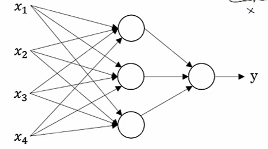
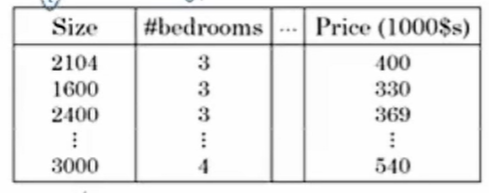
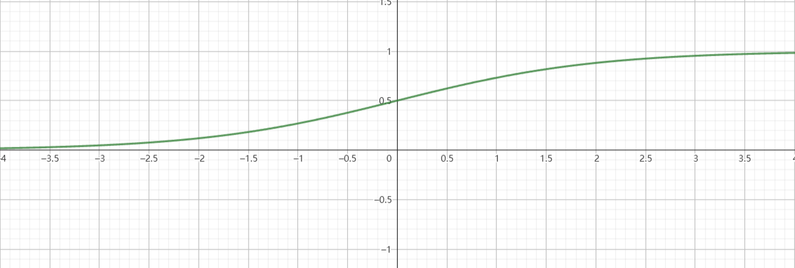

# 深度学习

> [深度学习-吴恩达](https://www.bilibili.com/video/BV1ev4y1U7j2)

## 神经网络

神经网络（`Neural Network`，`NN`）是一种模拟人类大脑工作方式的计算模型，它在深度学习和机器学习领域中扮演着重要角色。

### 什么是神经网络

- 神经网络，也被称为人工神经网络（ANN），由大量相互关联的节点（或称为“神经元”）组成。这些节点按照分层结构排列，通过加权连接传输和处理数据。
- 神经网络的灵感来自于生物大脑的神经元之间的相互作用。它模拟了神经元之间的信号传递方式，使其能够处理复杂的数据输入并执行各种任务，例如分类、回归、模式识别等。
- 多层神经网络是深度学习算法的基础，因此也被称为深度神经网络。
- 神经网络的目标是通过学习数据来识别模式、分类数据以及预测未来事件。

输入特征 `x` 得到/预测 结果 `y` 

### 神经网络的工作原理

- 神经网络将输入分解为多个抽象层，每一层都由多个神经元组成。
- 每个神经元与其他神经元相连，具有关联的权重和阈值。如果某个神经元的输出高于指定的阈值，它将被激活，并将数据传递到网络的下一层。
- 神经网络依赖于训练数据来学习并提高其准确性。一旦对其准确性进行微调，它们就成为了强大的工具，用于数据分类、聚类和其他任务。
- 例如，Google 的搜索算法就是基于神经网络的。

#### 神经网络的类型

- 感知器是最古老的神经网络，由 `Frank Rosenblatt` 在 1958 年创建。它是神经网络的基本形式。
- 卷积神经网络（CNN）主要用于图像识别、模式识别和计算机视觉。
- 循环神经网络（RNN）用于处理时间序列数据，例如股票市场预测或销售预测。

## 监督学习与神经网络

 在监督学习中，首先输入`x`，然后通过`x`学习到一个函数，最后这个函数能够将`x`映射到`y`。

例如，根据房屋特征`x`去估计房屋的售价`y`：

此外如图片识别、语音识别等。

### 结构化和非结构化数据

#### 什么是结构化数据

结构化数据是基于数据库的数据。每个特征 `x` 都有清晰的定义。

举个例子：在房价预测中，也许会有一个数据库或列表，它将告诉你房屋面积和卧室数量等信息，这就是结构化数据。

#### 什么是非结构化数据

非结构化数据类似于音频、原始音频、图片或文本这种数据，这里特征也许是图片中的像素值或一段文本中的独立单词。

非结构化数据常常比结构化数据的学习要困难得多。

### 深度学习变欢迎的原因

对于传统学习算法处理问题时，在大量工作的效率往往不高或停滞，深度学习缓解了这个问题，提升工作效率，且与原始输入的数据大小成正比，即规模推动深度学习进步。

事实上今天，想要达到高性能，最可靠的方法之一是要么训练一个大网络，要么放更多的数据。然后这个在一定程度后也会达到瓶颈，因为最终你会用光所有数据，或者最终你的网络实在太大了，训练得花很长时间，但是，光是改善规模就足以帮助我们在深度学习里面前进一大步。

深度学习可以视为在**经验 --> 想法 --> 代码实现**进行重复循环。新/好的算法可以加速这一过程。

## 二元分类

深度学习的二元分类是指使用深度神经网络（DNN）进行两类别（二元）问题的分类任务。这类任务通常涉及将输入数据分为两个不同的类别或类别之一的任务。例如，垃圾邮件检测、疾病诊断、图像识别中的二元分类等。

深度学习模型在二元分类任务中通常具有多层次的结构，这些结构可以学习数据中的复杂特征，以便做出正确的分类决策。

## 逻辑回归

逻辑回归是一种常用于二元分类问题的统计学习方法，它虽然带有“回归”一词，但实际上是一种分类算法。逻辑回归模型通过将线性函数与逻辑函数（也称为sigmoid函数）组合来进行二元分类。

### 逻辑分布

逻辑分布是一种连续型的概率分布，其**分布函数**和**密度函数**分别为：
$$
F(x) = P(X \leq x)=\frac{1}{1+e^{-(x-\mu)/\gamma}} 
$$

$$
f(x) = F^{'}(X \leq x)=\frac{e^{-(x-\mu)/\gamma}}{\gamma(1+e^{-(x-\mu)/\gamma})^{2}}
$$

其中：

- $x$ 是输入的特征值。
- $P(X \leq x)$ 是输入特征值 $x$ 对应的真实类别标签的概率。
- $\mu$ 和 $\gamma$ 是模型的参数，它们可以通过训练数据来学习。

$F(x)$：

$f(x)$：

:::tip 提示

上面图像为近似图像，非真实情况。

:::

逻辑回归模型将输入特征映射到一个概率值，该概率值表示输入特征属于某一类别的概率。通过比较概率值的大小，逻辑回归模型可以进行二元分类预测。

### 逻辑回归

以二分类为例，对于所给数据集假设存在这样的一条直线可以将数据完成线性可分。决策边界可以表示为 $w_1x_1+w_2x_2+b=0$，假设某个样本点 $w_1x_1+w_2x_2+b=0$ 那么可以判断它的类别为 1，这个过程其实是感知机。

逻辑回归还需要加一层，它要找到分类概率 `P(Y=1)` 与输入向量 `x` 的直接关系，然后通过比较概率值来判断类别。

考虑二分类问题，给定数据集：
$$
 D={(x_{1}, y_{1}),(x_{2},y_{2}),\cdots,(x_{N}, y_{N})}, x_{i} \subseteq R^{n}, y_{i} \in {0,1},i=1,2,\cdots,N
$$
考虑到 $w^{T}x+b$ 取值是连续的，因此它不能拟合离散变量。可以考虑用它来拟合条件概率 $p(Y=1|x)$，因为概率的取值也是连续的。

但是对于 𝑤≠0 （若等于零向量则没有什么求解的价值）， $w^{T}x+b$ 取值为 𝑅 ，不符合概率取值为 0 到 1，因此考虑采用广义线性模型。

最理想的是单位阶跃函数：
$$
p(y=1 | x)=\begin{cases} 0,& z\lt 0 \\ 0.5,& z = 0\\ 1,& z\gt 0\ \end{cases} ,\quad z=w^T x+b
$$
