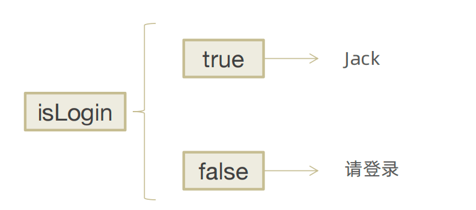
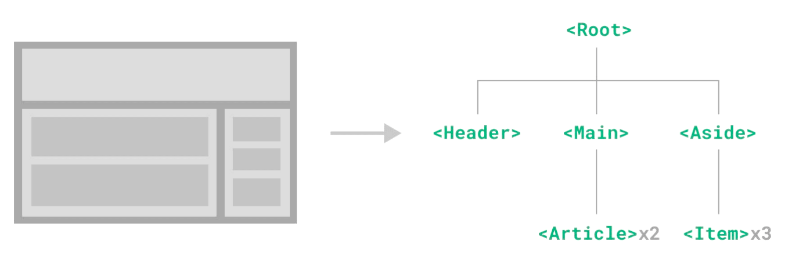
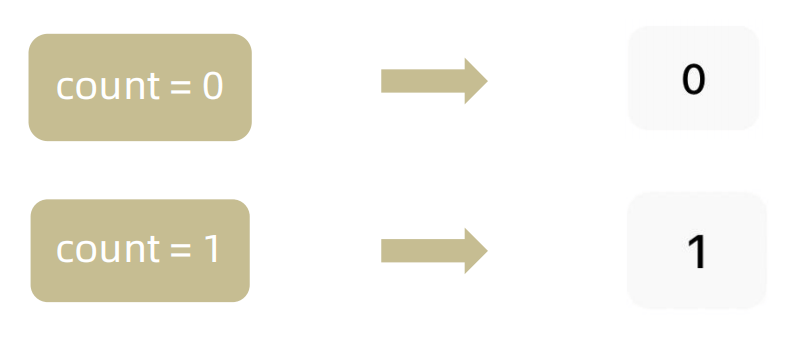
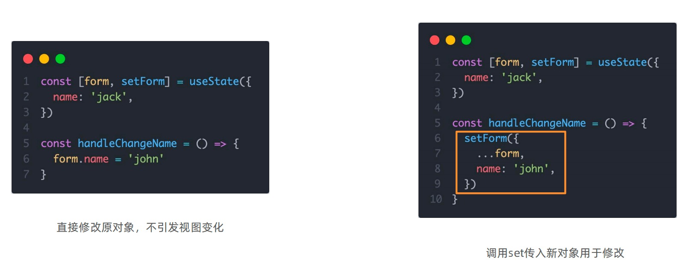
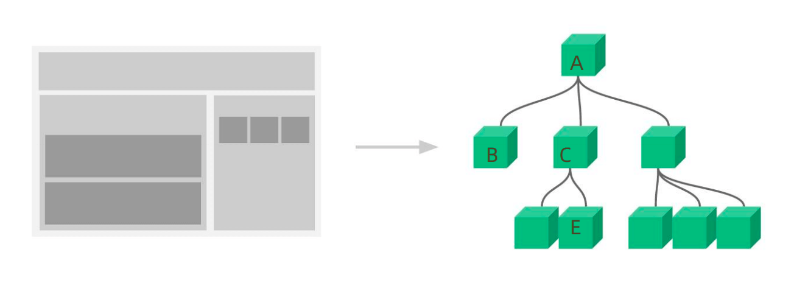
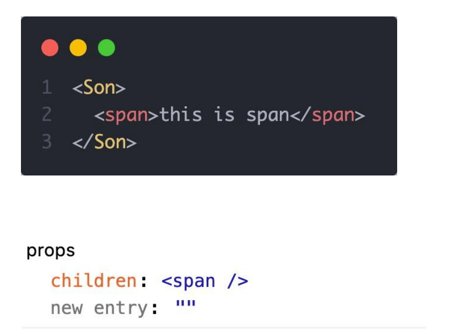
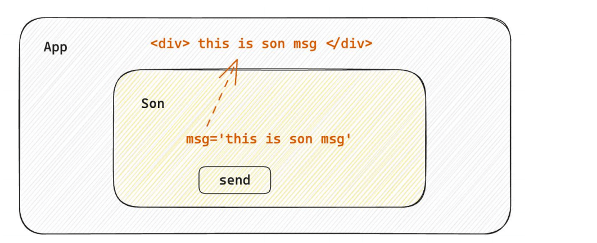
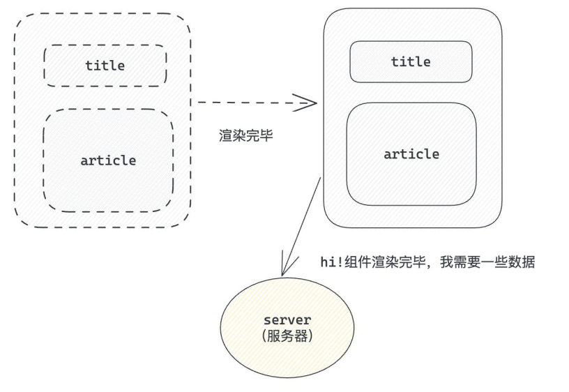
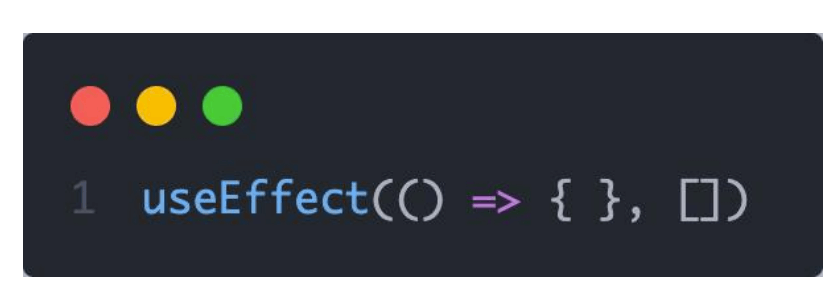
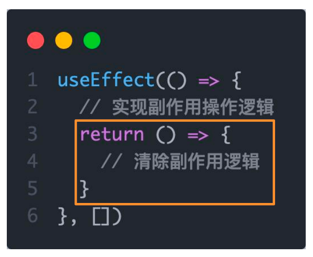

# React

> [官方文档](https://react.dev/learn)

## 开发环境创建

`create-react-app` 是一个快速创建 `React` 开发环境的工具，底层由 `Webpack` 构件，封装了配置细节，开箱即用
执行命令：

```sh
npx create-react-app react-basic
```

## JSX基础

## 什么是JSX

概念：`JSX` 是 `JavaScript` 和 `XMl`(HTML)的缩写，表示在 `JS` 代码中编写 `HTML` 模版结构，它是 `React` 中构建 `UI` 的方式

```jsx
const message = 'this is message'

function App(){
  return (
    <div>
      <h1>this is title</h1>
      {message}
    </div>
  )
}
```

优势：

1. `HTML` 的声明式模版写法
2. `JavaScript` 的可编程能力

### JSX的本质

`JSX` 并不是标准的 `JS` 语法，它是 `JS` 的语法扩展，浏览器本身不能识别，需要通过解析工具做解析之后才能在浏览器中使用


### JS表达式

> 在 `JSX` 中可以通过 `大括号语法{}` 识别 `JavaScript` 中的表达式，比如常见的变量、函数调用、方法调用等等

1. 使用引号传递字符串
2. 使用 `JS` 变量
3. 函数调用和方法调用
4. 使用 `JavaScript` 对象
   :::warning 警告
   注意：`if` 语句、`switch` 语句、变量声明不属于表达式，不能出现在 `{}` 中
   :::

```jsx
const message = 'this is message'

function getAge(){
  return 18
}

function App(){
  return (
    <div>
      <h1>this is title</h1>
      {/* 字符串识别 */}
      {'this is str'}
      {/* 变量识别 */}
      {message}
      {/* 变量识别 */}
      {message}
      {/* 函数调用 渲染为函数的返回值 */}
      {getAge()}
    </div>
  )
}
```

### 列表渲染


> 在JSX中可以使用原生js种的`map方法` 实现列表渲染

```jsx
const list = [
  {id:1001, name:'Vue'},
  {id:1002, name: 'React'},
  {id:1003, name: 'Angular'}
]

function App(){
  return (
    <ul>
      {list.map(item=><li key={item.id}>{item}</li>)}
    </ul>
  )
}
```

### 条件渲染



在React中，可以通过逻辑与运算符 `&&`、三元表达式(`?:`) 实现基础的条件渲染

```jsx
const flag = true
const loading = false

function App(){
  return (
    <>
      {flag && <span>this is span</span>}
      {loading ? <span>loading...</span>:<span>this is span</span>}
    </>
  )
}
```

### 复杂条件渲染

> 需求：列表中需要根据文章的状态适配
> 解决方案：自定义函数 + 判断语句

```jsx
const type = 1  // 0|1|3

function getArticleJSX(){
  if(type === 0){
    return <div>无图模式模版</div>
  }else if(type === 1){
    return <div>单图模式模版</div>
  }else(type === 3){
    return <div>三图模式模版</div>
  }
}

function App(){
  return (
    <>
      { getArticleJSX() }
    </>
  )
}
```

## React的事件绑定

### 基础实现

> React中的事件绑定，通过语法 `on + 事件名称 = { 事件处理程序 }`，整体上遵循驼峰命名法

```jsx
function App(){
  const clickHandler = ()=>{
    console.log('button按钮点击了')
  }
  return (
    <button onClick={clickHandler}>click me</button>
  )
}
```

### 使用事件参数

> 在事件回调函数中设置形参e即可

```jsx
function App(){
  const clickHandler = (e)=>{
    console.log('button按钮点击了', e)
  }
  return (
    <button onClick={clickHandler}>click me</button>
  )
}
```

### 传递自定义参数

> 语法：事件绑定的位置改造成箭头函数的写法，在执行 `clickHandler` 实际处理业务函数的时候传递实参

```jsx
function App(){
  const clickHandler = (name)=>{
    console.log('button按钮点击了', name)
  }
  return (
    <button onClick={()=>clickHandler('jack')}>click me</button>
  )
}
```

:::warning 注意
注意：不能直接写函数调用，这里事件绑定需要一个函数引用
:::

### 同时传递事件对象和自定义参数

> 语法：在事件绑定的位置传递事件实参e和自定义参数，`clickHandler` 中声明形参，注意顺序对应

```jsx
function App(){
  const clickHandler = (name,e)=>{
    console.log('button按钮点击了', name,e)
  }
  return (
    <button onClick={(e)=>clickHandler('jack',e)}>click me</button>
  )
}
```

## React组件基础使用

### 组件是什么

概念：一个组件就是一个用户界面的一部分，它可以有自己的逻辑和外观，组件之间可以互相嵌套，也可以服用多次


### 组件基础使用

> 在React中，一个组件就是**首字母大写的函数**，内部存放了组件的逻辑和视图UI, 渲染组件只需要把组件当成标签书写即可

```jsx
// 1. 定义组件
function Button(){
  return <button>click me</button>
}

// 2. 使用组件
function App(){
  return (
    <div>
      {/* 自闭和 */}
      <Button/>
      {/* 成对标签 */}
      <Button></Button>
    </div>
  )
}
```

## 组件状态管理-useState

### 基础使用

> `useState` 是一个 React Hook（函数），它允许我们向组件添加一个`状态变量`, 从而控制影响组件的渲染结果
> 和普通JS变量不同的是，状态变量一旦发生变化组件的视图UI也会跟着变化（数据驱动视图）



```jsx
function App(){
  const [ count, setCount ] = React.useState(0)
  return (
    <div>
      <button onClick={()=>setCount(count+1)}>{ count }</button>
    </div>
  )
}
```

### 状态的修改规则

> 在React中状态被认为是只读的，我们应该始终`替换它而不是修改它`, 直接修改状态不能引发视图更新


### 修改对象状态

> 对于对象类型的状态变量，应该始终给set方法一个`全新的对象` 来进行修改



## 组件的基础样式处理

React组件基础的样式控制有俩种方式，行内样式和 `class` 类名控制

```jsx
<div style={{ color:'red'}}>this is div</div>
```

```css
.foo{
  color: red;
}
```

```jsx
import './index.css'

function App(){
  return (
    <div>
      <span className="foo">this is span</span>
    </div>
  )
}
```

## React表单控制

### 受控绑定

概念：使用React组件的状态（`useState`）控制表单的状态


```jsx
function App(){
  const [value, setValue] = useState('')
  return (
    <input 
      type="text" 
      value={value} 
      onChange={e => setValue(e.target.value)}
    />
  )
}
```

### 非受控绑定

概念：通过获取DOM的方式获取表单的输入数据

```jsx
function App(){
  const inputRef = useRef(null)

  const onChange = ()=>{
    console.log(inputRef.current.value)
  }
  
  return (
    <input 
      type="text" 
      ref={inputRef}
      onChange={onChange}
    />
  )
}
```

## React组件通信

概念：组件通信就是`组件之间的数据传递`, 根据组件嵌套关系的不同，有不同的通信手段和方法



1. A-B 父子通信
2. B-C 兄弟通信
3. A-E 跨层通信

### 父子通信-父传子


#### 基础实现

**实现步骤 **

1. 父组件传递数据 - 在子组件标签上绑定属性 
2. 子组件接收数据 - 子组件通过props参数接收数据

```jsx
function Son(props){
  return <div>{ props.name }</div>
}


function App(){
  const name = 'this is app name'
  return (
    <div>
       <Son name={name}/>
    </div>
  )
}
```

#### props说明

**props可以传递任意的合法数据**，比如数字、字符串、布尔值、数组、对象、函数、JSX

**props是只读对象**
子组件只能读取 `props` 中的数据，不能直接进行修改, 父组件的数据只能由父组件修改 

#### 特殊的prop-chilren

场景：当我们把内容嵌套在组件的标签内部时，组件会自动在名为 `children` 的 `prop` 属性中接收该内容



### 父子通信-子传父



核心思路：在子组件中调用父组件中的函数并传递参数

```tsx
function Son({ onGetMsg }){
  const sonMsg = 'this is son msg'
  return (
    <div>
      {/* 在子组件中执行父组件传递过来的函数 */}
      <button onClick={()=>onGetMsg(sonMsg)}>send</button>
    </div>
  )
}


function App(){
  const getMsg = (msg)=>console.log(msg)
  
  return (
    <div>
      {/* 传递父组件中的函数到子组件 */}
       <Son onGetMsg={ getMsg }/>
    </div>
  )
}
```

### 兄弟组件通信


> 实现思路: 借助 `状态提升` 机制，通过共同的父组件进行兄弟之间的数据传递
>
> 1. A组件先通过子传父的方式把数据传递给父组件App
> 2. App拿到数据之后通过父传子的方式再传递给B组件

```jsx
// 1. 通过子传父 A -> App
// 2. 通过父传子 App -> B

import { useState } from "react"

function A ({ onGetAName }) {
  // Son组件中的数据
  const name = 'this is A name'
  return (
    <div>
      this is A compnent,
      <button onClick={() => onGetAName(name)}>send</button>
    </div>
  )
}

function B ({ name }) {
  return (
    <div>
      this is B compnent,
      {name}
    </div>
  )
}

function App () {
  const [name, setName] = useState('')
  const getAName = (name) => {
    setName(name)
  }
  return (
    <div>
      this is App
      <A onGetAName={getAName} />
      <B name={name} />
    </div>
  )
}

export default App
```

### 跨层组件通信


**实现步骤：**

1. 使用 `createContext`方法创建一个上下文对象Ctx 
2. 在顶层组件（App）中通过 `Ctx.Provider` 组件提供数据 
3. 在底层组件（B）中通过 `useContext` 钩子函数获取消费数据

```jsx
// App -> A -> B

import { createContext, useContext } from "react"

// 1. createContext方法创建一个上下文对象

const MsgContext = createContext()

function A () {
  return (
    <div>
      this is A component
      <B />
    </div>
  )
}

function B () {
  // 3. 在底层组件 通过useContext钩子函数使用数据
  const msg = useContext(MsgContext)
  return (
    <div>
      this is B compnent,{msg}
    </div>
  )
}

function App () {
  const msg = 'this is app msg'
  return (
    <div>
      {/* 2. 在顶层组件 通过Provider组件提供数据 */}
      <MsgContext.Provider value={msg}>
        this is App
        <A />
      </MsgContext.Provider>
    </div>
  )
}

export default App
```

## React副作用管理-useEffect

### 概念理解 

`useEffect` 是一个React Hook函数，用于在React组件中创建不是由事件引起而是由渲染本身引起的操作（副作用）, 比如发送 `AJAX` 请求，更改 `DOM` 等等 

:::warning 注意
说明：上面的组件中没有发生任何的用户事件，组件渲染完毕之后就需要和服务器要数据，整个过程属于“只由渲染引起的操作”
:::

### 基础使用

需求：在组件渲染完毕之后，立刻从服务端获取平道列表数据并显示到页面中


说明： 

1. 参数1是一个函数，可以把它叫做副作用函数，在函数内部可以放置要执行的操作 ；
2. 参数2是一个数组（可选参），在数组里放置依赖项，不同依赖项会影响第一个参数函数的执行，当是一个空数组的时候，副作用函数只会在组件渲染完毕之后执行一次。

### useEffect依赖说明 

`useEffect` 副作用函数的执行时机存在多种情况，根据传入依赖项的不同，会有不同的执行表现

| **依赖项**     | **副作用功函数的执行时机**      |
| -------------- | ------------------------------- |
| 没有依赖项     | 组件初始渲染 + 组件更新时执行   |
| 空数组依赖     | 只在初始渲染时执行一次          |
| 添加特定依赖项 | 组件初始渲染 + 依赖项变化时执行 |

### 清除副作用

概念：在 `useEffect` 中编写的由渲染本身引起的对接组件外部的操作，社区也经常把它叫做副作用操作，比如在 `useEffect` 中开启了一个定时器，我们想在组件卸载时把这个定时器再清理掉，这个过程就是清理副作用


:::warning 注意
说明：清除副作用的函数最常见的执行时机是在组件卸载时自动执行
:::

```jsx
import { useEffect, useState } from "react"

function Son () {
  // 1. 渲染时开启一个定时器
  useEffect(() => {
    const timer = setInterval(() => {
      console.log('定时器执行中...')
    }, 1000)

    return () => {
      // 清除副作用(组件卸载时)
      clearInterval(timer)
    }
  }, [])
  return <div>this is son</div>
}

function App () {
  // 通过条件渲染模拟组件卸载
  const [show, setShow] = useState(true)
  return (
    <div>
      {show && <Son />}
      <button onClick={() => setShow(false)}>卸载Son组件</button>
    </div>
  )
}

export default App
```

## 自定义Hook实现

概念：自定义`Hook`是以 `use打头的函数`，通过自定义Hook函数可以用来`实现逻辑的封装和复用`


```jsx
// 封装自定义Hook

// 问题: 布尔切换的逻辑 当前组件耦合在一起的 不方便复用

// 解决思路: 自定义hook

import { useState } from "react"

function useToggle () {
  // 可复用的逻辑代码
  const [value, setValue] = useState(true)

  const toggle = () => setValue(!value)

  // 哪些状态和回调函数需要在其他组件中使用 return
  return {
    value,
    toggle
  }
}

// 封装自定义hook通用思路

// 1. 声明一个以use打头的函数
// 2. 在函数体内封装可复用的逻辑（只要是可复用的逻辑）
// 3. 把组件中用到的状态或者回调return出去（以对象或者数组）
// 4. 在哪个组件中要用到这个逻辑，就执行这个函数，解构出来状态和回调进行使用


function App () {
  const { value, toggle } = useToggle()
  return (
    <div>
      {value && <div>this is div</div>}
      <button onClick={toggle}>toggle</button>
    </div>
  )
}

export default App
```

## React Hooks使用规则

1. 只能在组件中或者其他自定义 `Hook` 函数中调用
2. 只能在组件的顶层调用，不能嵌套在 `if`、`for`、其它的函数中


